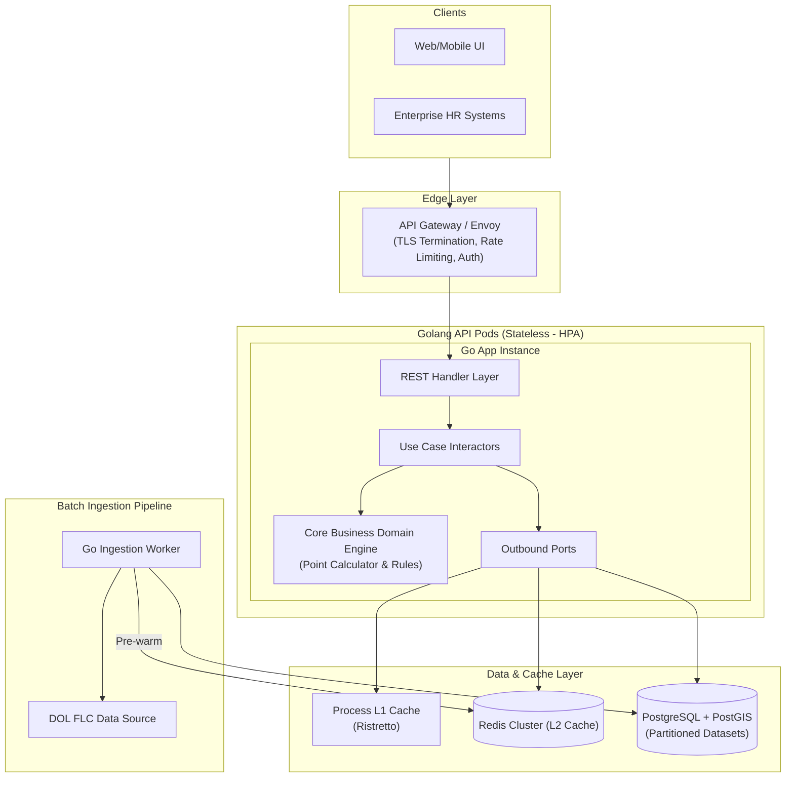

# Architectural Implementation Plan: U.S. DOL Prevailing Wage Backend Service

## 1. Problem Statement

Determining the **Prevailing Wage Level** as specified by the U.S. Department of Labor (DOL) Foreign Labor Certification (OFLC) is a critical requirement for U.S. immigration processes, including H-1B, H-1B1, E-3 visas, and PERM labor certifications.

The prevailing wage is defined as the average wage paid to similarly employed workers in a specific occupation within the area of intended employment. Calculating this rate requires processing and integrating multiple heterogeneous datasets:
1. **OEWS (Occupational Employment and Wage Statistics)**: Annual wage tables categorizing wages into 4 Tiers (Level I: Entry, Level II: Qualified, Level III: Experienced, Level IV: Fully Competent).
2. **Standard Occupational Classification (SOC)**: 6-digit standardized job roles.
3. **O*NET Metadata & Job Zones**: Baseline Specific Vocational Preparation (SVP) thresholds, typical education requirements, and skill categories.
4. **Geographic Mapping**: Cross-referencing 5-digit US ZIP Codes $\rightarrow$ FIPS County Codes $\rightarrow$ BLS Metropolitan Statistical Areas (MSA).
5. **Complex Point-Based Calculation Rules**: Evaluating a specific position's job description (Education, Years of Experience, Special Skills, and Supervisory Responsibilities) against baseline O*NET SVP guidelines to assign the correct wage tier (I to IV).

Currently, organizations face challenges due to manual wage calculations, lack of standardized audit trails, annual dataset schema updates, and performance bottlenecks when evaluating thousands of positions. 

This project builds a **production-grade, low-latency, scalable microservice in Golang** that automates 4-tier wage determinations, resolves complex geographic mappings, provides zero-downtime dataset updates, and generates immutable audit certificates.

---

## 2. Requirements Specification

### Functional Requirements (FRs)

* **FR-1: Instant Wage Lookup API**
  * Query 4-tier prevailing wages (hourly and annual) by 6-digit SOC code and location identifiers (ZIP Code, FIPS County Code, or BLS MSA Area Code).
  * Support historical dataset queries by fiscal/program year (e.g., `2025-2026`).

* **FR-2: Automated 4-Tier Wage Level Assessment Engine**
  * Evaluate custom job specifications against DOL evaluation guidelines across 4 categories:
    1. **Education**: Compare required degree against O*NET baseline.
    2. **Experience**: Compare required years of experience against O*NET SVP month thresholds.
    3. **Special Skills / Licensure**: Assess specialized credentials, foreign languages, or proprietary tools.
    4. **Supervisory Duties**: Evaluate management and supervisory scope.
  * Accrue points starting from baseline Level I and clamp the final output between Level I and Level IV.
  * Generate a step-by-step mathematical rationale breakdown explaining the bump rationale.

* **FR-3: Bulk / Batch Query Operations**
  * Support batch requests (up to 100 queries per payload) for corporate enterprise systems.

* **FR-4: Occupational & Geographic Discovery**
  * Full-text search and auto-complete for SOC codes and job titles.
  * Endpoint to resolve ZIP Code $\rightarrow$ FIPS County $\rightarrow$ MSA BLS Area.

* **FR-5: Audit Log & Certificate Generation**
  * Assign a unique, immutable Determination Tracking Number (`PWD-YYYY-XXXXXX`) to every wage calculation.
  * Provide downloadable JSON and printable PDF determination certificates for immigration audit compliance.

* **FR-6: Asynchronous Ingestion & Zero-Downtime Swap**
  * Background batch worker to download, stream, and parse annual DOL datasets (CSV/XLSX).
  * Atomic pointer swap to activate new program year datasets without taking the API offline.

---

### Non-Functional Requirements (NFRs)

* **NFR-1: Performance & Low Latency**
  * **L1 In-Memory Cache Latency**: $< 1\text{ ms}$
  * **L2 Redis Cache Latency**: $< 5\text{ ms}$
  * **Database Lookup Latency (p95)**: $< 30\text{ ms}$
  * **End-to-End API SLA (p95)**: $< 50\text{ ms}$

* **NFR-2: Financial & Precision Accuracy**
  * Zero floating-point rounding errors on currency calculations using fixed-point representation (`shopspring/decimal`).

* **NFR-3: High Availability & Fault Tolerance**
  * **99.9% Uptime SLA**.
  * Graceful fallback from L2 Redis to PostgreSQL if cache fails.

* **NFR-4: Scalability & Concurrency**
  * Stateless API pods horizontally scalable via Kubernetes HPA based on CPU/RPS.
  * Stream processing for CSV ingestion using Go worker channels to maintain low memory footprint ($< 250\text{ MB}$ RAM during multi-gigabyte file loads).

* **NFR-5: Maintainability & Clean Architecture**
  * Strict separation of concerns using **Hexagonal Architecture (Ports and Adapters)**.
  * Zero external framework imports in the core domain logic layer.

* **NFR-6: Security & Compliance**
  * API Key / JWT Authentication, TLS 1.3 encryption in transit, rate-limiting per client, and sanitized SQL parameters to prevent injection.

---

## 3. System Architecture & Design

### High-Level Component Flow Diagram



### Hexagonal Architecture (Ports & Adapters Layout)

```text
cmd/
  ├── api/                    # Application Entrypoint (Server startup & dependency injection)
  └── worker/                 # Batch Data Ingestion Worker Entrypoint
internal/
  ├── domain/                 # Core Business Logic (Pure Go, zero external dependencies)
  │   ├── model/              # Entities: WageMatrix, SOCCode, PointGrid, DeterminationLog
  │   └── service/            # Rules Engine: PointCalculator, SVPComparator, GeoResolver
  ├── usecase/                # Application Workflows & Interactors
  │   ├── wage_lookup_uc.go
  │   ├── level_calculator_uc.go
  │   └── dataset_ingestion_uc.go
  ├── adapter/                # Driving Adapters (Input)
  │   ├── http/               # REST Handlers, DTOs, Routes, Middleware
  │   └── grpc/               # gRPC Service Implementations
  └── infrastructure/         # Driven Adapters (Output)
      ├── persistence/        # PostgreSQL Repositories (pgx/sqlx)
      ├── cache/              # L1 Ristretto & L2 Redis Adapters
      ├── parser/             # Stream CSV/XLSX File Parsers
      └── pdf/                # PDF Certificate Generator
pkg/                          # Utility packages (Logger, Telemetry, Decimal Math)
```

### Multi-Level Caching & Data Swap Strategy
1. **Read Request Flow**: Check **L1 Process Cache** $\rightarrow$ Check **L2 Redis Cluster** $\rightarrow$ Fallback to **PostgreSQL Database** $\rightarrow$ Populate L2 & L1 Caches.
2. **Zero-Downtime Dataset Swap**:
   * New DOL data loaded into shadow partition table `prevailing_wages_2026_2027`.
   * Atomic update of `dataset_versions.is_active` pointer.
   * Atomic flush of Redis cache keys for active year tag.

---

## 4. Database Schema & Use Cases

```mermaid
erdiagram
    dataset_versions ||--o{ prevailing_wages : "contains"
    soc_codes ||--o{ prevailing_wages : "has wage data for"
    bls_areas ||--o{ prevailing_wages : "defines region for"
    zip_code_mappings }|--|| fips_counties : "belongs to"
    fips_counties }|--|| bls_areas : "mapped to"
    soc_codes ||--|| onet_occupations : "extends"
    wage_determination_logs }|--|| dataset_versions : "evaluated under"

    dataset_versions {
        uuid id PK
        string program_year UK
        boolean is_active
        date effective_start_date
    }
    soc_codes {
        string soc_code PK
        string title
        text description
    }
    bls_areas {
        string area_code PK
        string area_name
        string area_type
    }
    prevailing_wages {
        uuid id PK
        uuid dataset_version_id FK
        string soc_code FK
        string area_code FK
        decimal level_1_hourly
        decimal level_1_annual
        decimal level_4_annual
    }
    wage_determination_logs {
        uuid id PK
        string determination_number UK
        int assigned_level
        jsonb rationale_breakdown
    }
```

### Detailed Table Specifications

#### 1. `dataset_versions`
* **Purpose**: Tracks active and historical DOL program year releases. Powers atomic zero-downtime swaps.
* **Columns**:
  * `id` (UUID, PK)
  * `program_year` (VARCHAR(20), Unique - e.g., `"2025-2026"`)
  * `is_active` (BOOLEAN - only one row `TRUE` at a time)
  * `release_date` (DATE)
  * `effective_start_date` (DATE)
  * `effective_end_date` (DATE)
  * `created_at` (TIMESTAMPTZ)
* **Indexes**: `idx_dataset_active` ON `(is_active) WHERE is_active = TRUE`

#### 2. `soc_codes`
* **Purpose**: Stores standard 6-digit Standard Occupational Classification roles.
* **Columns**:
  * `soc_code` (VARCHAR(10), PK - e.g., `"15-1252.00"`)
  * `title` (VARCHAR(255))
  * `description` (TEXT)
  * `major_group` (VARCHAR(100))
* **Indexes**: GIN full-text index on `(title, description)`

#### 3. `onet_occupations`
* **Purpose**: O*NET metadata required for 4-tier level calculation logic.
* **Columns**:
  * `soc_code` (VARCHAR(10), PK, FK referencing `soc_codes.soc_code`)
  * `job_zone` (INT, 1 to 5)
  * `svp_range_min` (INT, months of preparation)
  * `svp_range_max` (INT, months of preparation)
  * `default_education_level` (VARCHAR(50))
  * `sample_titles` (JSONB)

#### 4. `fips_counties`
* **Purpose**: Standardized U.S. FIPS County lookup table.
* **Columns**:
  * `fips_code` (VARCHAR(5), PK - e.g., `"06075"`)
  * `state_abbr` (VARCHAR(2))
  * `county_name` (VARCHAR(100))

#### 5. `bls_areas`
* **Purpose**: Bureau of Labor Statistics Metropolitan Statistical Areas (MSAs).
* **Columns**:
  * `area_code` (VARCHAR(10), PK - e.g., `"41860"`)
  * `area_title` (VARCHAR(255))
  * `area_type` (VARCHAR(20) - `MSA`, `NON_METRO`, `STATEWIDE`)
  * `state_abbr` (VARCHAR(2))

#### 6. `area_fips_mapping`
* **Purpose**: Maps U.S. Counties (FIPS) to BLS Wage Areas.
* **Columns**:
  * `area_code` (VARCHAR(10), FK)
  * `fips_code` (VARCHAR(5), FK)
  * Composite PK: `(area_code, fips_code)`

#### 7. `zip_code_mappings`
* **Purpose**: Maps 5-digit U.S. ZIP codes to FIPS County and primary city.
* **Columns**:
  * `zip_code` (VARCHAR(5), PK)
  * `fips_code` (VARCHAR(5), FK)
  * `primary_city` (VARCHAR(100))
  * `state_abbr` (VARCHAR(2))
  * `latitude` (DECIMAL(9,6))
  * `longitude` (DECIMAL(9,6))
* **Indexes**: B-Tree on `(zip_code)`

#### 8. `prevailing_wages` (Partitioned Table)
* **Purpose**: Core wage lookup table storing hourly and annual rates for Level I, II, III, and IV.
* **Columns**:
  * `id` (UUID, PK)
  * `dataset_version_id` (UUID, FK)
  * `soc_code` (VARCHAR(10), FK)
  * `area_code` (VARCHAR(10), FK)
  * `level_1_hourly` (DECIMAL(10,2)), `level_1_annual` (DECIMAL(12,2))
  * `level_2_hourly` (DECIMAL(10,2)), `level_2_annual` (DECIMAL(12,2))
  * `level_3_hourly` (DECIMAL(10,2)), `level_3_annual` (DECIMAL(12,2))
  * `level_4_hourly` (DECIMAL(10,2)), `level_4_annual` (DECIMAL(12,2))
  * `mean_wage_hourly` (DECIMAL(10,2)), `mean_wage_annual` (DECIMAL(12,2))
  * `geo_level` (VARCHAR(5))
* **Indexes**: Composite Unique Index on `(dataset_version_id, soc_code, area_code)`

#### 9. `wage_determination_logs`
* **Purpose**: Immutable compliance log storing calculation inputs, outputs, and rationales.
* **Columns**:
  * `id` (UUID, PK)
  * `determination_number` (VARCHAR(50), Unique - e.g., `"PWD-2026-984321"`)
  * `client_id` (VARCHAR(100))
  * `dataset_version_id` (UUID, FK)
  * `soc_code` (VARCHAR(10), FK)
  * `area_code` (VARCHAR(10), FK)
  * `input_payload` (JSONB)
  * `assigned_level` (INT)
  * `determined_wage_hourly` (DECIMAL(10,2))
  * `determined_wage_annual` (DECIMAL(12,2))
  * `rationale_breakdown` (JSONB)
  * `created_at` (TIMESTAMPTZ)
* **Indexes**: Index on `(determination_number)` and `(client_id, created_at)`

---

## 5. Complete REST API Specifications

### 1. Instant Wage Lookup
* **`GET /api/v1/wages/lookup`**
* **Query Params**: `soc_code` (req), `zip_code` (opt), `fips_code` (opt), `area_code` (opt), `program_year` (opt)
* **Response (200 OK)**:
  ```json
  {
    "status": "success",
    "data": {
      "soc_code": "15-1252.00",
      "soc_title": "Software Developers",
      "area_code": "41860",
      "area_title": "San Francisco-Oakland-Hayward, CA",
      "program_year": "2025-2026",
      "wages": {
        "level_1": { "hourly": 52.40, "annual": 108992.00 },
        "level_2": { "hourly": 65.10, "annual": 135408.00 },
        "level_3": { "hourly": 77.80, "annual": 161824.00 },
        "level_4": { "hourly": 90.50, "annual": 188240.00 },
        "mean":    { "hourly": 71.45, "annual": 148616.00 }
      }
    }
  }
  ```

### 2. Automated Wage Level Calculator
* **`POST /api/v1/wages/determine-level`**
* **Request Body**:
  ```json
  {
    "soc_code": "15-1252.00",
    "zip_code": "94103",
    "job_title": "Senior Software Engineer",
    "education": {
      "required_degree": "Master",
      "field_of_study": "Computer Science"
    },
    "experience_months": 48,
    "special_skills": ["Go", "Distributed Systems", "Kubernetes"],
    "supervises_employees": true,
    "number_of_subordinates": 3
  }
  ```
* **Response (200 OK)**:
  ```json
  {
    "status": "success",
    "data": {
      "determination_number": "PWD-2026-984321",
      "soc_code": "15-1252.00",
      "assigned_level": 3,
      "prevailing_wage": {
        "hourly": 77.80,
        "annual": 161824.00,
        "period": "Year"
      },
      "rationale_breakdown": {
        "base_level": 1,
        "education_points": 0,
        "experience_points": 1,
        "skills_points": 1,
        "supervision_points": 0,
        "total_calculated_points": 2,
        "final_level": 3,
        "explanation": [
          "+1 Level for Experience (48 mos exceeds baseline SVP range)",
          "+1 Level for Special Skills (Custom tech stack requirements)"
        ]
      }
    }
  }
  ```

### 3. Bulk Batch Wage Query
* **`POST /api/v1/wages/batch-lookup`**
* **Request Body**: Array of `[{ "soc_code": "...", "zip_code": "..." }]` (Max 100).

### 4. Occupational Search & Auto-complete
* **`GET /api/v1/occupations/search?q=Software&limit=5`**

### 5. Location Resolver
* **`GET /api/v1/locations/resolve?zip_code=94103`**
* **Response**: `ZIP 94103 -> FIPS 06075 (San Francisco County) -> MSA 41860`.

### 6. Audit Certificate Download
* **`GET /api/v1/determinations/{determination_number}`**
* **`GET /api/v1/determinations/{determination_number}/export?format=pdf`**

### 7. Admin Data Ingestion & Version Activation
* **`POST /api/v1/admin/datasets/ingest`**
* **`POST /api/v1/admin/datasets/{id}/activate`**

---

## 6. Golang Structs, Interfaces & Implementation Blueprints

Below are the exact Go domain interfaces, entities, repository abstractions, and business rule workflows that will be implemented.

### Core Domain Entities (`internal/domain/model/`)

#### 1. Wage Matrix Entity
```go
package model

import (
	"time"
	"github.com/shopspring/decimal"
)

type WageTier struct {
	Hourly decimal.Decimal `json:"hourly"`
	Annual decimal.Decimal `json:"annual"`
}

type WageMatrix struct {
	ID               string          `json:"id"`
	DatasetVersionID string          `json:"dataset_version_id"`
	SOCCode          string          `json:"soc_code"`
	AreaCode         string          `json:"area_code"`
	Level1           WageTier        `json:"level_1"`
	Level2           WageTier        `json:"level_2"`
	Level3           WageTier        `json:"level_3"`
	Level4           WageTier        `json:"level_4"`
	Mean             WageTier        `json:"mean"`
	GeoLevel         string          `json:"geo_level"`
	UpdatedAt        time.Time       `json:"updated_at"`
}
```

#### 2. Job Requirement & Assessment Entities
```go
package model

type EducationLevel string

const (
	DegreeBachelor EducationLevel = "Bachelor"
	DegreeMaster   EducationLevel = "Master"
	DegreeDoctorate EducationLevel = "Doctorate"
)

type EducationRequirement struct {
	RequiredDegree EducationLevel `json:"required_degree"`
	FieldOfStudy   string         `json:"field_of_study"`
}

type JobRequirementPayload struct {
	SOCCode              string               `json:"soc_code"`
	ZIPCode              string               `json:"zip_code"`
	JobTitle             string               `json:"job_title"`
	Education            EducationRequirement `json:"education"`
	ExperienceMonths     int                  `json:"experience_months"`
	SpecialSkills        []string             `json:"special_skills"`
	SupervisesEmployees  bool                 `json:"supervises_employees"`
	NumberOfSubordinates int                  `json:"number_of_subordinates"`
}

type RationaleBreakdown struct {
	BaseLevel             int      `json:"base_level"`
	EducationPoints       int      `json:"education_points"`
	ExperiencePoints      int      `json:"experience_points"`
	SkillsPoints          int      `json:"skills_points"`
	SupervisionPoints     int      `json:"supervision_points"`
	TotalCalculatedPoints int      `json:"total_calculated_points"`
	FinalLevel            int      `json:"final_level"`
	Explanation           []string `json:"explanation"`
}

type DeterminationResult struct {
	DeterminationNumber string             `json:"determination_number"`
	SOCCode             string             `json:"soc_code"`
	AssignedLevel       int                `json:"assigned_level"`
	DeterminedWage      WageTier           `json:"determined_wage"`
	Rationale           RationaleBreakdown `json:"rationale_breakdown"`
}
```

---

### Inbound Ports / Use Case Interfaces (`internal/usecase/`)

```go
package usecase

import (
	"context"
	"yourproject/internal/domain/model"
)

type IWageLookupUseCase interface {
	LookupWage(ctx context.Context, socCode, zipCode, fipsCode, areaCode, programYear string) (*model.WageMatrix, error)
	BatchLookupWages(ctx context.Context, requests []model.WageLookupRequest) ([]*model.WageMatrix, error)
}

type ILevelCalculatorUseCase interface {
	DetermineWageLevel(ctx context.Context, payload model.JobRequirementPayload) (*model.DeterminationResult, error)
}

type IIngestionUseCase interface {
	IngestDOLDataset(ctx context.Context, fileURL, programYear string) (string, error)
	ActivateDatasetVersion(ctx context.Context, datasetID string) error
}

type IDeterminationAuditUseCase interface {
	GetDeterminationByNumber(ctx context.Context, number string) (*model.DeterminationResult, error)
}
```

---

### Outbound Ports / Repository Interfaces (`internal/domain/service/` & `infrastructure/`)

```go
package service

import (
	"context"
	"yourproject/internal/domain/model"
)

// Repository for querying wage datasets
type IWageRepository interface {
	GetWage(ctx context.Context, datasetVersionID, socCode, areaCode string) (*model.WageMatrix, error)
	SaveWageBatch(ctx context.Context, wages []*model.WageMatrix) error
}

// Repository for location resolution
type IGeoRepository interface {
	ResolveZipToAreaCode(ctx context.Context, zipCode string) (areaCode string, fipsCode string, err error)
}

// Repository for O*NET Metadata
type IONetRepository interface {
	GetOccupationDetails(ctx context.Context, socCode string) (*model.ONetOccupation, error)
}

// Data store for compliance logs
type IDeterminationLogRepository interface {
	SaveLog(ctx context.Context, log *model.DeterminationLog) error
	FindByNumber(ctx context.Context, number string) (*model.DeterminationLog, error)
}

// Multi-Level Cache Abstraction
type ICacheManager interface {
	Get(ctx context.Context, key string, target interface{}) (bool, error)
	Set(ctx context.Context, key string, value interface{}, ttlSeconds int) error
	InvalidateByPattern(ctx context.Context, pattern string) error
}
```

---

### Core Business Logic Workflow: 4-Tier Point Evaluator Engine

The evaluation logic in `internal/domain/service/point_calculator.go` operates on pure Go business rules without DB or HTTP ties:

```text
Step 1: Fetch O*NET Occupation Baseline for SOC Code (Job Zone, SVP Min/Max, Default Degree).
Step 2: Base Level = 1. Points = 0.
Step 3: Evaluate Education:
        - If Required Degree > Default Degree -> Add +1 or +2 points.
Step 4: Evaluate Experience:
        - Convert Required Experience Months to SVP Scale.
        - If Experience > SVP Max -> Add +1 or +2 points based on degree of excess.
Step 5: Evaluate Special Skills & Licenses:
        - If special technical credentials/languages requested -> Add +1 point.
Step 6: Evaluate Supervisory Duties:
        - If position supervises staff beyond baseline occupation scope -> Add +1 point.
Step 7: Final Level = Clamp(Base Level + Total Points, Min: 1, Max: 4).
Step 8: Fetch wage matrix for assigned level (Level 1, 2, 3, or 4).
```

---

## 7. Verification & Testing Strategy

1. **Unit Testing (`go test -race ./...`)**:
   * Mock repositories using `gomock` or standard interface stubs.
   * Unit test the 4-tier point evaluator engine across 20+ edge cases (e.g., Job Zone 5 roles, entry level candidates, max level bounds).

2. **Integration Testing**:
   * Use `testcontainers-go` to spin up ephemeral PostgreSQL & Redis containers.
   * Test database migration scripts, composite index queries, and JSONB rationale storage.

3. **Performance & Benchmark Testing (`go test -bench`)**:
   * Verify L1/L2 cache hit performance under 10,000 concurrent goroutine lookups.
   * Target memory allocations: 0 allocations/op on cached read paths.

4. **PDF Certificate Generation Verification**:
   * Verify generated audit certificate PDFs match DOL presentation requirements.
